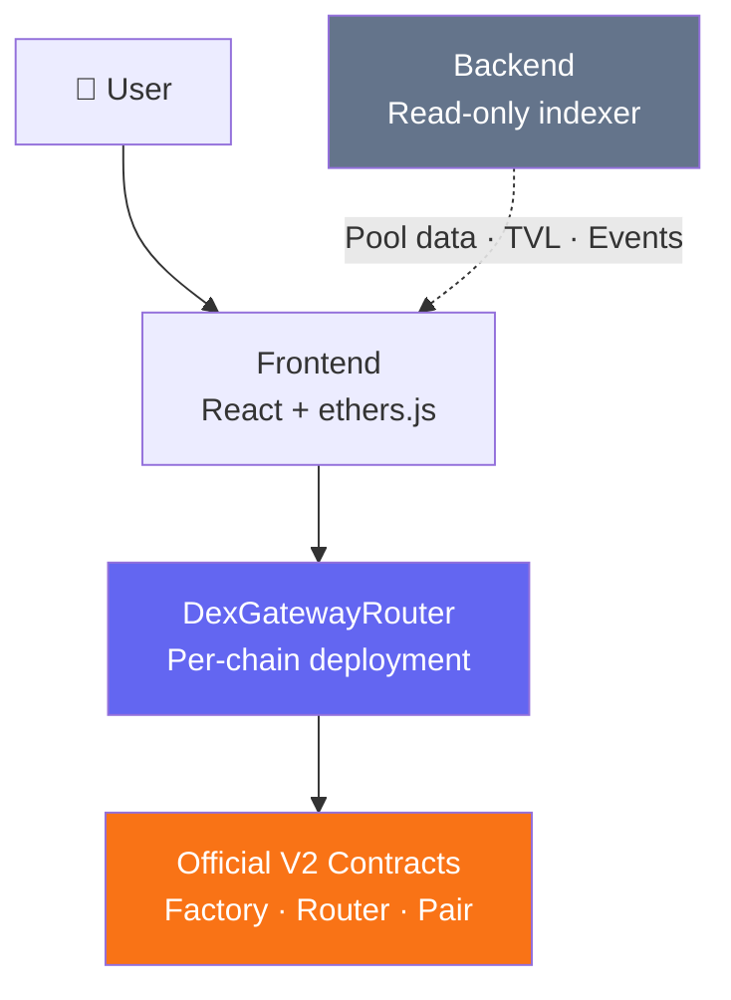
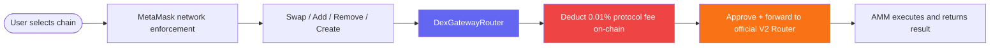
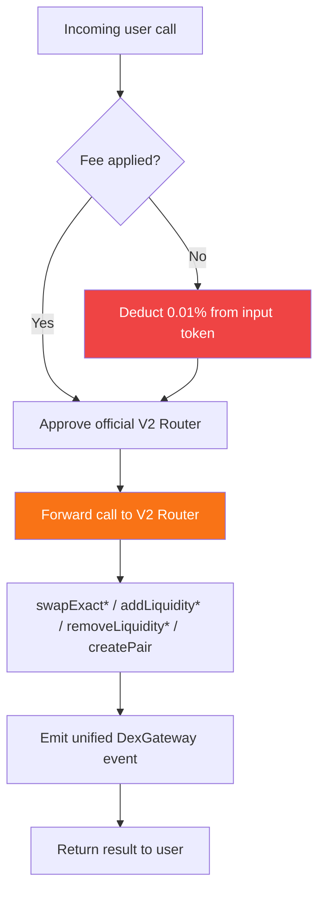

<div align="center">

# DexGateway

**Multi-Chain AMM Execution Infrastructure**

*One router. Every chain. Every V2 pool.*

<br/>

[](https://github.com)
[](https://github.com)
[](https://soliditylang.org)
[](https://book.getfoundry.sh)
[](LICENSE)

</div>

---

## What is DexGateway?

**DexGateway is a multi-chain liquidity execution gateway that unifies interaction with Uniswap V2–based DEXes into a single, standardized routing layer.**

It provides swap, liquidity management, pool creation, and portfolio tracking across 8 EVM networks — while enforcing a minimal on-chain protocol fee through a controlled gateway router.

DexGateway is **integration-first**. No AMM logic is reimplemented. No DEX core contracts are forked or modified. It is structured middleware between users and decentralized liquidity.
```
[ User ] ──► [ ExchangeDeskRouter ] ──► [ Official V2 Router / Factory / Pair ]
                     │
               Fee deducted
               on-chain (0.01%)
               non-bypassable
```

---

## Design Philosophy

| DexGateway IS | DexGateway is NOT |
|---|---|
| A structured execution gateway | A DEX or AMM implementation |
| A unified multi-chain routing layer | A cross-chain bridge |
| A router-enforced fee layer | A price oracle or aggregator |
| Infrastructure for V2 liquidity surfaces | A trading terminal or analytics product |

---

## Supported Networks

DexGateway currently supports the following EVM-compatible blockchains:

- Ethereum
- BNB Chain
- Arbitrum
- Polygon
- Avalanche
- Base
- Unichain
- Shibarium

Each network will have its own deployed `ExchangeDeskRouter.sol` instance.
Execution is always single-chain — no cross-chain routing is abstracted.

---

## Supported DEX Integrations

DexGateway currently supports major Uniswap V2 fork exchanges:

| DEX | Network |
|---|---|
| Uniswap | Ethereum, Arbitrum, Base |
| SushiSwap | Multi-chain |
| PancakeSwap | BNB Chain |
| QuickSwap | Polygon |
| BaseSwap | Base |
| ShibaSwap | Shibarium |
| Pangolin | Avalanche |

All integrations use the **official Factory / Router / Pair contracts** of each protocol.
DexGateway does not modify or replace any AMM logic.

---

## Core Capabilities

DexGateway enables users to:

- Swap tokens via V2 pools
- Add liquidity to existing pools
- Remove liquidity from positions
- Create new token pairs
- View portfolio balances (tokens + LP positions)
- Inspect pool reserves and share ratios
- Execute everything through one unified router layer

The interface currently includes:

- Home
- Swap
- Add Liquidity
- Remove Liquidity
- Portfolio

---

## System Architecture

DexGateway enforces clean separation between frontend, on-chain routing, and backend indexing.



### Execution Flow


---

## System Layers

### 1 — Frontend (React + ethers.js)

The frontend handles all user-facing coordination. It is **not** a security engine and does not execute AMM math.

Responsibilities:
- Wallet connection via MetaMask (EIP-1193)
- Chain selector + network switching enforcement
- Slippage calculation and input validation
- Decimal normalization
- Token selection and portfolio rendering

The wallet's connected network must match the selected chain before any execution is permitted.


### 2 — ExchangeDexRouter (On-Chain)

Each supported chain has its own `ExchangeDexRouter.sol` deployment. It is a **thin execution gateway** — not an AMM.


The router:
- Pulls tokens from the user
- Deducts the fee on-chain (non-bypassable via frontend)
- Approves the official DEX router
- Forwards the call
- Emits a standardized event for backend indexing

The router does **not** reimplement AMM math, modify reserve logic, or perform any cross-chain execution.


### 3 — Backend (Read-Only)

The backend is a strictly read-only indexing and serving layer.

Responsibilities:
- Index pools and events per chain
- Calculate TVL from reserve data
- Aggregate user LP positions
- Serve fast APIs for UI rendering

The backend never signs transactions, holds keys, or touches user funds.

---

## Fee Model

DexGateway enforces a `0.01% protocol fee` via its on-chain router.

- Fee is deducted before forwarding to official DEX routers.
- Fee logic cannot be bypassed through frontend manipulation.
- Fee is applied only at the DexGateway routing layer.

This ensures consistent platform-level monetization while preserving original AMM mechanics.

---

## Security Considerations

- No reimplementation of AMM math — all execution delegated to official contracts
- No custody of user funds at any layer
- Minimal Solidity logic surface in `ExchangeDexRouter.sol`
- Fee enforcement is on-chain and cannot be bypassed
- Backend is read-only with no signing capability
- Wallet network enforcement prevents execution on mismatched chains

---

## Getting Started
```bash
# Clone
git clone https://github.com/Sourav-IIITBPL/DexGateway && cd dexgateway

# Install contracts
forge install

# Run tests
forge test -vv

# Install frontend
cd frontend && npm install && npm run dev

# Install backend
cd backend && npm install && npm run dev
```

---

## Project Status

> 🟡 **Under Active Development** — Core swap and liquidity routing is implemented. Ongoing work: indexing improvements, UI refinement, and multi-chain consistency.

---

<div align="center">

**Ethereum · BNB Chain · Arbitrum · Polygon · Avalanche · Base · Unichain · Shibarium**

*DexGateway — One router. Every V2 pool.*

</div>

